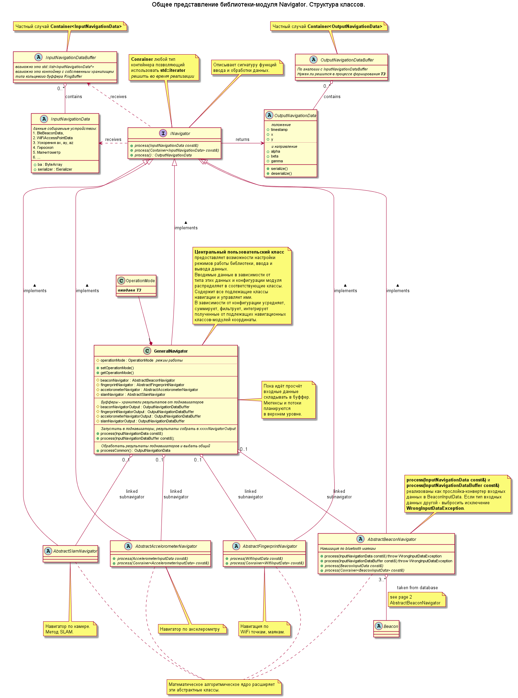
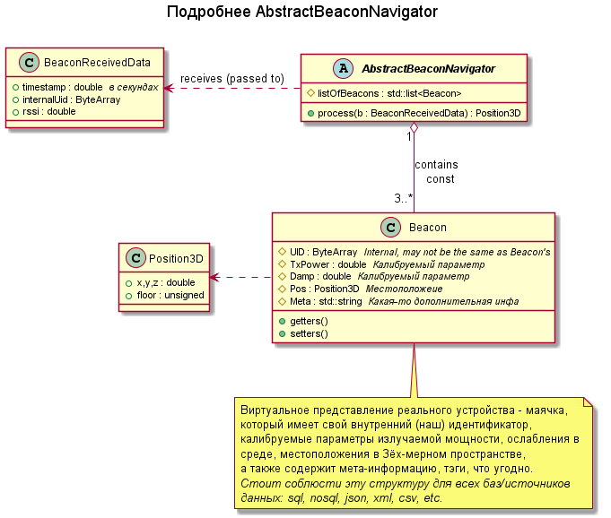
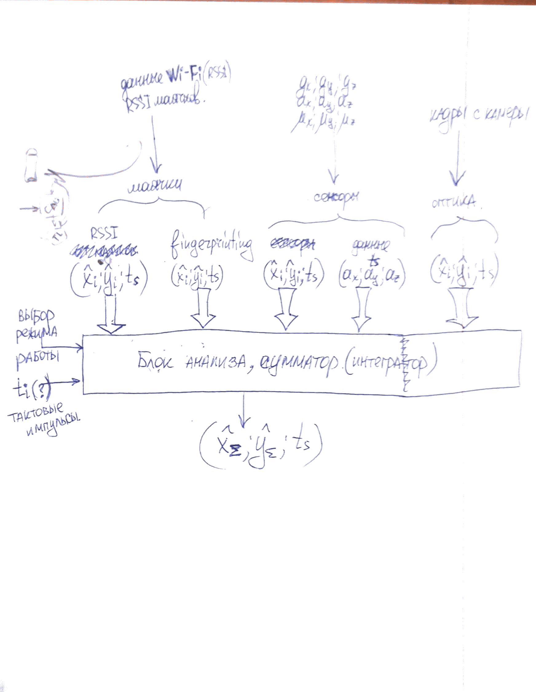
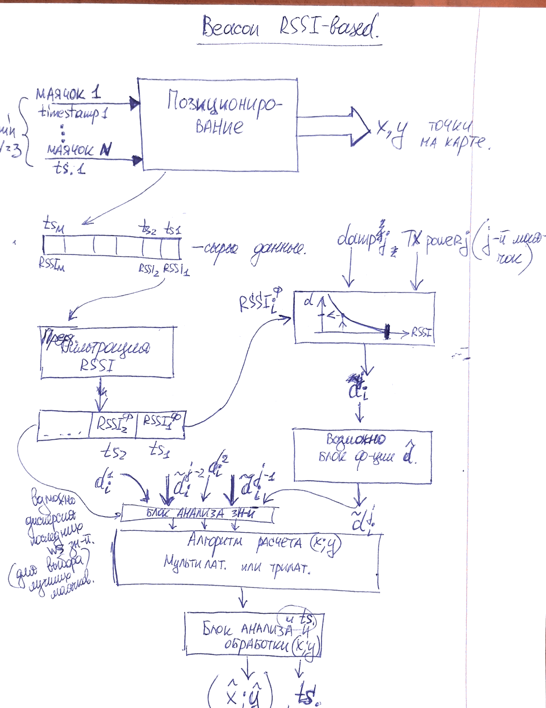
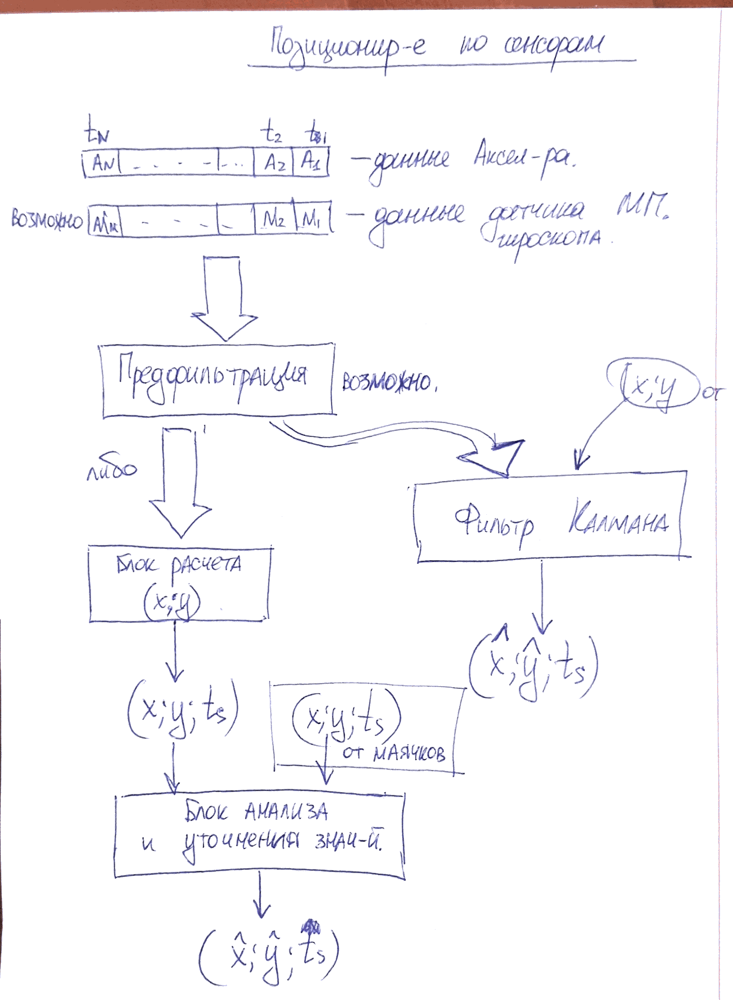
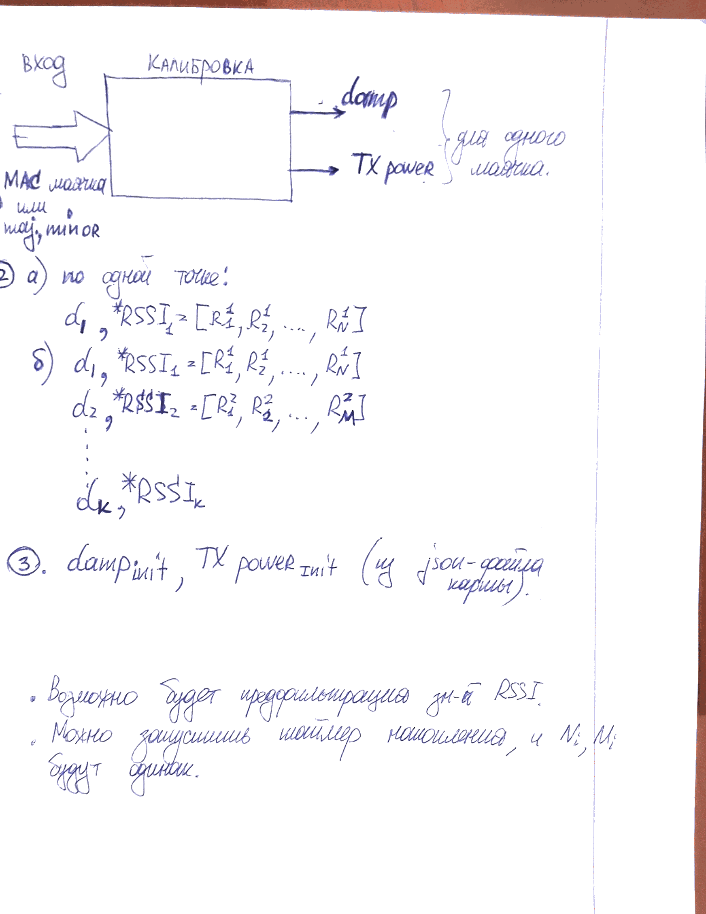
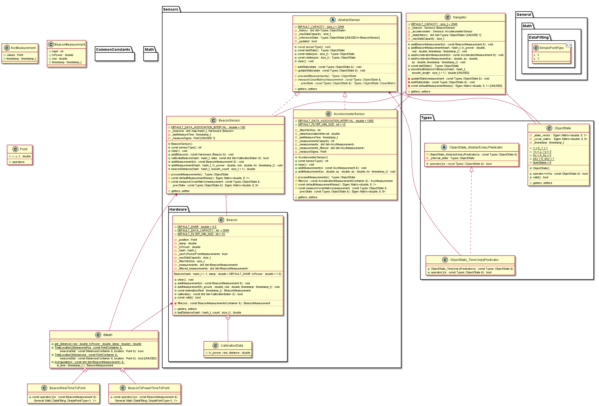

Navigator Library (`LibNavigator`)
=======
Библиотека для (indoor) навигациии внутри зданий исходя из показаний датчиков,
сигналов, от радио-маяков, фото- и видеокадров. Ориентирована на работу на 
носимых устройствах-гаджетах.

Использование
---------------
Диаграммма классов показывает структуру и снабжена комментариями.  
Рисунок 1.  


Пример использования в общем случае кодом:
```
void configure(){
	GeneralNavirator gn1;
	gn1.beaconNavigator = new BeaconNavigatorType1();
	gn1.fingerprintNavigator = new FingNavigatorTypeX();
	// ... другие возможности конфигурации? ...
}
void onNewInputData(InputNavigatorData ind){
	gn1.process(ind);
	// или собирать в InputNavigationDataBuffer, потом подать когда надо.
}  
void periodicallyPollCommonPosition(){
	gn1.processCommon();
}
```
Здесь `BeaconNavigatorType1` - наследник `AbstractBeaconNavigator`, принимает RSSI и 
имея карту(таблицу) маяков, вычисляет текущее местоположение.    
`onNewInputData` - обработчик события получены новые данные. В метод `INavigator::process()` 
также можно подавать пачки данных, например `std::list<InputNavigatorData>`. 
Пачки могут в значительной степени снизить вычислительную нагрузку, зависит от алгоритма.  
`periodicallyPollCommonPosition()` вызывается периодически для расчета конечных результатов.    
`GeneralNavirator` по сути координатор потоков данных. Распределяет входные данные 
по соответствующим навигаторам, собирает выходные данные.   
`GeneralNavirator::process()` распределяет входные данные по соответствующим 
подлежащим навигаторам, например, `beaconNavigator`. Те, в свою очередь, фильтруют, 
обрабатывают, пересчитывают, и возвращают текущую, по рассчётам каждого из навигаторов. 
Результат этой функции пачка вычисленных позиций `OutputNavigationData` 
от каждого из навигаторов. Эти данные используются    
`GeneralNavirator::processCommon()`, который суммируем, анализирует и фильтрует выходные данные с подлежащих 
навигаторов (поднавигаторов). Возвращает **общий конечный результат**.  
> Потокобезопаность и защиту объектов от concurrent access обеспечивает пользователь.

> Для асинхронного ввода данных и синхронного вывода пользователь 
в одном потоке вводит данные, в другом вызывает процессинг и 
забирает результат.

Пример 2. Использование в одном потоке, неэффективно, но имеет право быть:
```C++
using namespace IndoorNavigation;
void tread1(){
	GeneralNavirator gena;
	gena.config( GeneralNaviratorConfiguration(params) );  // или в
	while( InputDataBuffer idb = "receive new data from beacons, sensors, cameras" ){
		gena.process(idb);
		result = gena.processCommon(); 
	}
}
```

Описание классов и структуры
----------------

`InputData` универсальная порция входных данных в 
кросс-платформенном формате, например `ByteArray` или `JSON`, иными
словами то, что можно десериализовать в понятную структуру данных.   
`InputDataBuffer` - буффер входных данных. Какой-нибудь контейнер. Возможно потребуется 
специальная реализация. `std::list` и `std::vector`  подходят на эту роль. 

`INavigator` - интерфейс, который должен быть реализоован каждым навигатором.

Класс `GeneralNaviratorConfiguration` представляет возможную 
настройку `GeneralNavirator`а: *пока неизвестно что именно*. Например, включение/отключение 
опциональных фильтров и дополнительных процедур обработки, размеры буфферов.  

`GeneralNavirator` содержит ссылки на подлежащие навигаторы и реализует интерфейс INavigator
для пушинга входных данных и пуллинга выходных.
  
`AbstractXxxxxNavigator` абстракные классы навигаторов, которые предстоит унаследовать, 
реализуя конкретный математический алгоритм.


### Навигация по маякам - `AbstractBeaconNavigator` 
`AbstractBeaconNavigator` для работы требуется знать 
1) карту/таблицу/список калиброванных маяков.
2) данные RSSI от маяков поблизости. 
Какие из маяков поблизости них информативны, а какие нет (находятся за стенкой) решает этот
класс.

Рисунок 2.  



### Навигация по маякам - точкам доступа WiFi - `AbstractFingerprintNavigator` 
Аналогично с `AbstractBeaconNavigator`. *Требуется больше информации от закачика - уточнение
и расширение ТЗ*


Техническое задание
====
подано в виде ринуков и словесных описаний.  
1. 
2. 
3. 
4. 
**[Ссылка на ТЗ в Evernote](https://www.evernote.com/shard/s676/nl/159924744/a91bd946-fb37-44c9-9690-9be4d76f463e).**  


Что есть в настоящий момент
---------------------------
Корявая `tracking_lib` писанная на скорую руку. Названия классов сомнительные, функционал
размазан по нескольким сущностям. Присутствуют неиспользуемые/недореализованные метододы. 
Математические функции не имеют ссылок на алгоритмы и исходные математические формулы - 
вызывает сомнение. **Требует быть переписанной.** А вернее вытянуть из неё то, что работает 
и внедрить в новую более широкофункциональную структуру - LibNavigator.
Диаграмма классов существующей `tracking_lib`
